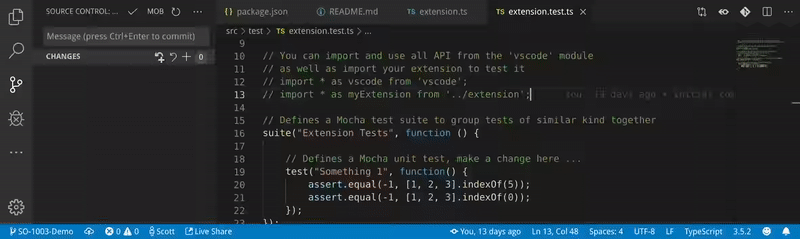

## Instructions



Prefix your branch with the JIRA ticket number (eg. SO-1001-Remove-Whitespace) for it to be parsed into the commit message.

Click the "MOB" button on the source control pane to populate the commit message with the files you have changed recently. Your commit message will be retained.
```
[SO-1001] Remove extra tabs ╠[["index.php",396,41]]╣
```

When it is your turn to drive, execute a git pull and then run "[MOB] Log Parse" from the actions pane to open the files in the last commits message to the specified line numbers. 

## Available Settings

* Pull file changes from the past X minutes into the commit message, this is recommended to be slightly higher than your standard mobbing time.
```json
    "mobTools.mobTime": 15
```

* A regular expression to extract from the branch name the ticket number.
```json
    "mobTools.pattern": "(SO-[0-9]*)"
```

* Ignore case in pattern.
```json
    "mobTools.patternIgnoreCase": false
```

* Content to place in commit message.
```json
    "mobTools.replacement": "[$1] "
```

## Coming Soon
- Storing breakpoints
- PHPStorm Plugin

## Installation
https://marketplace.visualstudio.com/items?itemName=sreed101.mobbing-tools